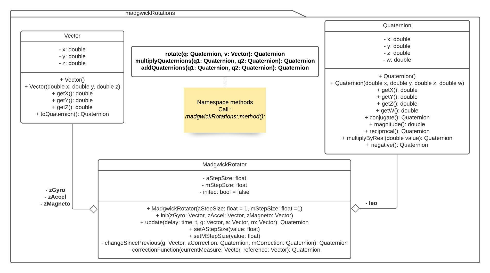

# MadgwickRotations - a Visual C++ class library
Author : Elliott Le Guéhennec (elliott.le_guehennec@etu.uca.fr)

Date : 2021-12-13

Version : 0.1

## Introduction
This class library was originally created for the DoMoCap project, aiming to create a universal platform to enable DIY VR equipments for SteamVR. This project was conducted by Elliott Le Guéhennec, Yorick Geoffre, Mattéo Broquet, Erwan Theron, and Jordan Gadet, and supervised by Marc Chevaldonné, as a second-year university project.

Many VR equipments, starting with gloves, rotate during their usages. A simple movement such as turning your wrist is considered one. In order to calculate those rotations, and represent them with a VR application, we have decided to employ quaternions.

## File layout

## Class diagram
